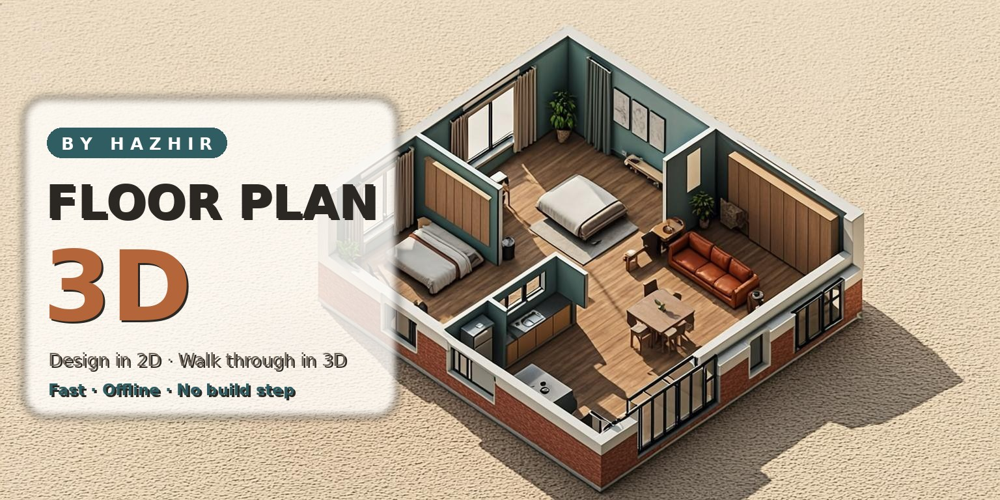
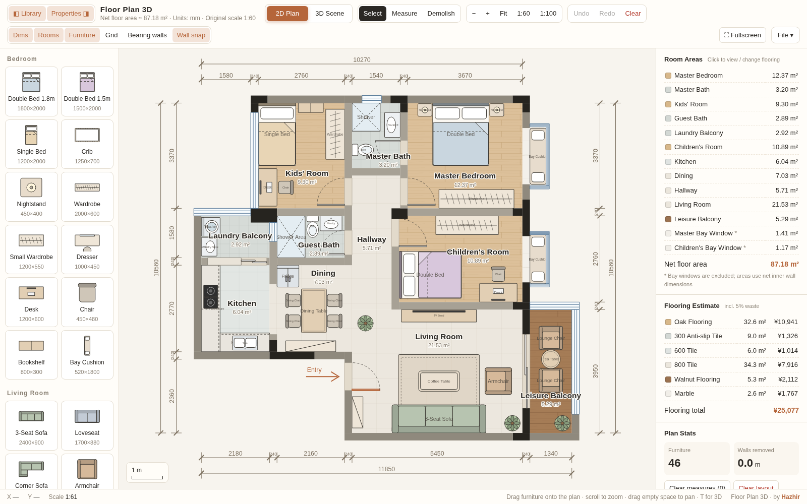
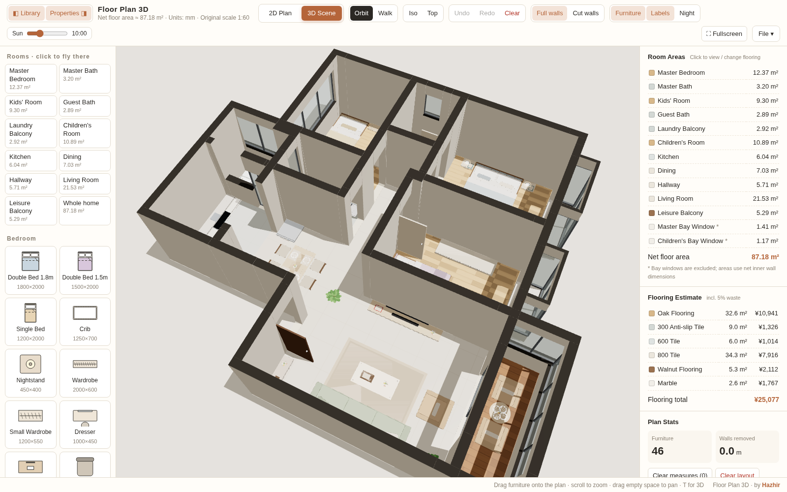
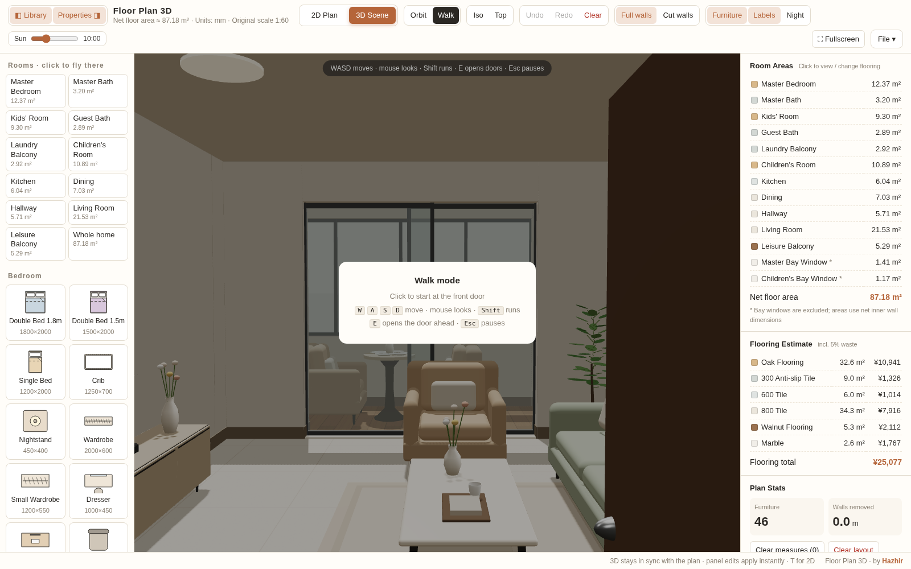

<p align="center">
  
</p>

<h1 align="center">Floor Plan 3D</h1>

<p align="center">
  <strong>Design a home in 2D — then walk through it in real-time 3D.</strong><br>
  A fast, fully offline interior design tool. Pure HTML/CSS/JS — no frameworks, no build step.
</p>

<p align="center">
  <a href="#-live-demo">🌐 Live Demo</a> ·
  <a href="#-features">✨ Features</a> ·
  <a href="#-build-the-windows-desktop-app">🖥️ Windows App</a> ·
  <a href="#-project-structure">📁 Structure</a> ·
  <a href="#-troubleshooting">🛠️ Troubleshooting</a>
</p>

<p align="center">
  
  
  
  
  
</p>

---

## 🌐 Live Demo

Once deployed (see [publishing](#-publishing-to-github--github-pages)), the web edition runs
directly on **GitHub Pages**:

> **`https://<your-username>.github.io/floorplan-3d/`**

The included workflow (`.github/workflows/deploy-pages.yml`) deploys it automatically on
every push to `main` — zero configuration, zero build.

## 📸 Screenshots

| 2D Plan Editor | 3D Scene |
| :---: | :---: |
|  |  |
| SVG plan with dimensions, furniture library & area stats | Orbit / iso / top-down cameras, real-time sync |

| First-Person Walk Mode |
| :---: |
|  |
| WASD + mouse look, open doors with **E** — works on touch too |

## ✨ Features

### 🏠 2D Floor Plan Editor
- **Precise plan at 1:60 / 1:100 scale** with full dimension lines (mm)
- **60+ furniture & appliance models** in 6 categories (bedroom, living room, dining & kitchen, bathroom, appliances, study & leisure)
- Drag from the library, then **move, rotate** (Shift = free angle) **and resize** with automatic wall snapping
- **Measure tool** that snaps to nearby walls (Shift locks horizontal / vertical)
- **Demolish non-bearing walls** — load-bearing walls are highlighted and protected
- Layer toggles: dimensions, room labels, furniture, grid, bearing walls, wall snap
- Undo / redo, and **auto-save to browser localStorage**

### 🛋️ Interactive 3D Scene
- **Instant 2D ↔ 3D switch** (button or `T`) — every edit syncs in real time
- Orbit, isometric and top-down cameras; **click a room in the list to fly to it**
- **First-person walk mode**: WASD + mouse look on desktop, virtual joystick on touch devices
- **Open and close doors** by clicking (or `E` in walk mode)
- Full-height / cut-away walls, **time-of-day sun slider**, night lighting
- Detailed furniture models: cabinet doors with handles, upholstered headboards, reflective metal & ceramic materials
- **Select and drag furniture in 3D** as well — kept in sync with the 2D plan

### 📐 Stats & Materials
- Automatic **room areas** and net floor area totals
- **Change flooring per room** (wood, tile, marble, terrazzo, carpet…) with a cost estimate including 5 % waste

### 💾 Import / Export
- **Export PNG** renders of the 3D scene
- **Export / import the whole plan as JSON** — share or version your designs
- Plans auto-save in the browser and reload automatically

### 🖥️ Desktop Edition (Electron)
- **100 % offline** — Three.js is bundled locally, no CDN, no internet required
- Native **Open / Save dialogs** for plan files, native **PNG export**
- Real application **menus + keyboard shortcuts** (`Ctrl+N / O / S / E`)
- GPU-accelerated rendering, window-state memory, single-instance lock
- Sandboxed renderer with hardened CSP

## 🎮 Keyboard Shortcuts

| Key | Action |
| --- | --- |
| `T` | Switch 2D plan ↔ 3D scene |
| `Shift + F` | Fullscreen |
| `Ctrl + Z` / `Ctrl + Shift + Z` | Undo / redo |
| `W A S D` + mouse | Walk mode movement |
| `E` | Open the door ahead (walk mode) |
| `Esc` | Pause walk mode |
| `Ctrl + N / O / S` | New / open / save plan (desktop) |

## 📁 Project Structure

```
floorplan-3d/
├─ public/                     ← the entire web app (pure static, zero build)
│  ├─ floorplan.html           ← the application: SVG 2D editor + Three.js 3D engine
│  ├─ vendor/                  ← locally bundled Three.js r160 + addons (offline)
│  └─ robots.txt
├─ desktop/                    ← Electron desktop edition (Windows / macOS / Linux)
│  ├─ src/
│  │  ├─ main.js               ← app:// protocol, native menus, save/open IPC, GPU flags
│  │  └─ preload.js            ← secure bridge exposed to the app (contextBridge)
│  ├─ scripts/
│  │  ├─ sync-app.mjs          ← copies public/ → desktop/app/ (single source of truth)
│  │  ├─ smoke.mjs             ← headless end-to-end smoke test of the packaged app
│  │  └─ fix-wincodesign-cache.mjs ← works around Windows symlink-permission errors
│  ├─ build/                   ← application icons
│  └─ package.json             ← electron-builder config (NSIS installer + portable exe)
├─ docs/
│  ├─ brand/                   ← banner & social-preview images
│  └─ screenshots/
├─ .github/workflows/
│  ├─ deploy-pages.yml         ← deploys the web app to GitHub Pages
│  └─ build-windows.yml        ← builds Windows .exe artifacts on tag / manual run
├─ build-windows.bat           ← one-click Windows build (installer + portable exe)
├─ publish-to-github.bat       ← push this project to your own GitHub repository
└─ README.md
```

The web app is a **single self-contained HTML file** — SVG for the 2D plan, Three.js (vendored)
for 3D. The Electron wrapper loads exactly the same file through a custom `app://` protocol,
which is why web and desktop always stay in sync.

## 🚀 Run the Web App Locally

The app uses ES modules, so it needs to be served over HTTP (any static server works —
there is **nothing to install or build**):

```bash
# Option A — Python (preinstalled on most systems)
cd public
python -m http.server 8000
# → open http://localhost:8000/floorplan.html

# Option B — Node
npx serve public
```

Or simply use the **Live Server** extension in VS Code and open `public/floorplan.html`.

## 🖥️ Build the Windows Desktop App

### One-click build (recommended)

1. Install **Node.js 18+** → [nodejs.org](https://nodejs.org) (one time)
2. **Double-click `build-windows.bat`**
3. Wait — on the first run it installs dependencies, then builds everything

You'll find both artifacts in `desktop/dist/`:

| File | What it is |
| --- | --- |
| `FloorPlan3D-Setup-1.0.0.exe` | Full **installer** (choose install folder, desktop & start-menu shortcuts) |
| `FloorPlan3D-Portable-1.0.0.exe` | **Portable** single file — run from anywhere, no install |

> 💡 **Windows SmartScreen note:** the binaries are unsigned (code-signing certificates cost
> money). Click *More info → Run anyway* — the app is fully open source, you can build it
> yourself right here.

> 💡 The build script automatically pre-seeds electron-builder's `winCodeSign` cache to avoid
> the well-known *"Cannot create symbolic link : A required privilege is not held by the
> client"* error, and falls back to a build without icon embedding if anything else fails.

### No Windows machine? Use GitHub Actions

Push the repo to GitHub, open the **Actions** tab → *Build Windows Desktop App* → **Run
workflow**. The job builds both `.exe` files on Microsoft's runners and uploads them as
downloadable artifacts. It also runs automatically on every `v*` version tag.

### Desktop development

```bash
cd desktop
npm install          # once
npm run start        # launch the app in dev mode
npm run dist         # build installer + portable exe
npm run smoke        # headless smoke test (renders the app, probes the API bridge)
```

Editing `public/floorplan.html` is all you ever need — `sync-app.mjs` (run automatically by
every script) copies it into the Electron shell.

## 📤 Publishing to GitHub & GitHub Pages

1. Create an empty repository on [github.com/new](https://github.com/new)
2. Double-click **`publish-to-github.bat`**, paste your repository URL — done
3. Enable Pages: **Settings → Pages → Source: GitHub Actions**
4. Your live site: `https://<your-username>.github.io/floorplan-3d/`
   *(update the Live Demo link above with your username)*

Optional: upload `docs/brand/social-preview.jpg` in **Settings → Social preview** so shared
links show the branded card.

## 🛠️ Troubleshooting

| Problem | Solution |
| --- | --- |
| Blank page when opening `floorplan.html` by double-click | ES modules can't load from `file://` — serve over HTTP (see above) or use the desktop app |
| SmartScreen blocked the `.exe` | *More info → Run anyway* (unsigned build) |
| Black 3D scene / poor performance | GPU driver issue — launch the desktop exe with `--disable-gpu` once to test, update GPU drivers |
| `Cannot create symbolic link` during build | Already handled automatically by `build-windows.bat`; as a manual fix enable Windows **Developer Mode** or run the terminal as Administrator |
| Plan data disappeared | The plan lives in browser localStorage — clearing site data resets it. Use *Export plan JSON* regularly as a backup |

## 🗺️ Roadmap Ideas

- [ ] Custom wall drawing (beyond the demo apartment)
- [ ] Multi-floor plans
- [ ] GLTF/GLB furniture import
- [ ] Auto-update channel (`electron-updater`)
- [ ] Code-signed Windows builds

## 👤 Credits

**Designed & developed by Hazhir** — engineered with AI assistance.

Built with [Three.js](https://threejs.org/) (r160, vendored) and
[Electron](https://www.electronjs.org/) 33.

## 📄 License

Released under the [MIT License](LICENSE) — © 2025 Hazhir. Free to use, modify and share.
